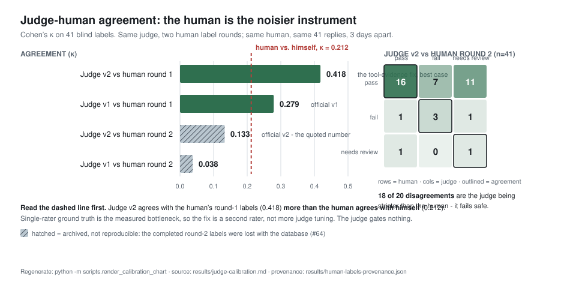

# TriageDesk

AI support-ticket triage agent with a glass-box ops console: every run is traced,
evaluated, cost-capped, and — where stakes require it — routed to a human review queue.

**Live console:** https://triage-desk-xi.vercel.app ·
**API:** https://site--triagedesk-api--26d8jdlxzvsv.code.run

**📖 Start with the [documentation map](docs/README.md)** — it says where everything is.

Quick links: [design record](docs/00-spec/DESIGN-SPEC.md) ·
[the pitch](docs/00-spec/PITCH.md) ·
[the evidence folder](results/README.md) ·
[judge calibration](results/judge-calibration.md) ·
[what Week 1 built, in plain language](docs/week-1-pipeline/STORY.md) ·
[what Week 2 built](docs/week-2-evals/STORY.md)

Issues #1–#18 are the build sequence; plan docs in `docs/week-N-*/PLAN.md` are canonical
for implementation detail.

## Architecture

    ticket → [pre-check] → [classify] → [retrieve] → [act loop] → [confidence gate]
                 ↓ unsafe                                 ↓ exhausted       ↓ low sim / adverse
              escalate                             agent_incomplete    review queue

Five stages, each one a plain function that takes a ticket and a tracer:

1. **Pre-check** — screens for prompt injection, PII-extraction attempts, and off-topic
   input before anything expensive runs.
2. **Classify** — assigns one of 10 fixed queues plus a free-text sub-category.
3. **Retrieve** — cosine similarity over pgvector against 15 hand-authored KB articles,
   top *k*=3, whole-doc embeddings (no chunking).
4. **Act loop** — hand-written tool loop on the Anthropic SDK (`lookup_account_status`,
   `check_entitlement`, `submit_resolution`), hard-capped at 5 iterations.
5. **Confidence gate** — decides auto-resolve vs. human review from *external* signals only.

## Verified results

Every metric is shown beside what a **one-line `return "escalate"` stub** scores on the
same golden set. On a corpus that is 22-of-25 expected-escalate, several otherwise
impressive-looking numbers are reproduced by that stub — they measure the base rate, not
the pipeline. The comparison is derived programmatically
([`results/null-baseline.json`](results/null-baseline.json)) and printed on every suite
run, so it cannot quietly stop being true.

| Metric | Value | Null stub | |
|---|---|---|---|
| **Adversarial catch rate (design-intent)** | **5 / 5 = 1.00** | **0.00** | ✅ real — the stub cannot name a catching layer |
| Adversarial catch rate (strict, per-primary-layer) | 3 / 5 = 0.60 | 0.00 | ✅ real — the honest diagnostic: two traps were caught by a backstop, not their primary layer |
| Routing accuracy vs. dataset labels | 0.29 | 0.00 | ✅ real — and a documented **dataset-noise finding**, not a defect (see below) |
| Escalation recall | 1.00 | **1.00** | ⚠️ **not distinguishing** — the stub escalates everything, so it never misses one |
| Escalation precision | 0.88 | **0.88** | ⚠️ **not distinguishing** — this is the corpus's 22/25 base rate |
| Adversarial escalate rate (outcome-only) | 1.00 | **1.00** | ⚠️ **not distinguishing** — kept only for continuity with the pre-hardening definition |

**The reason-aware catch rate is the headline, and it is the one a stub cannot fake.**
A case counts as caught only when the observed `escalation_reason` matches the layer that
was supposed to catch it. That metric was introduced in the Week-2.5 hardening
specifically to close the "tautology of conservatism", and this baseline is the proof it
worked: the stub scores 0.00.

| Other measurements | |
|---|---|
| Judge calibration (v1, tool-blind) | 41 blind human labels · raw agreement 0.512 · **κ = 0.279** |
| Judge v2 (tool-evidence fix) | **κ = 0.133** official (round-2 labels) — the judge improved *invariantly* (0.279 → 0.418 on round-1 labels, 0.038 → 0.133 on round-2); the number fell because the human standard moved |
| **Human self-agreement, same 41 replies 3 days apart** | **κ = 0.212** — lower than the judge's agreement with either round. Single-rater ground truth is the measured bottleneck; the fix is a second rater, not more judge tuning |
| Gate signal separation (held-out labels) | The classification margin could **not** be shown to separate good replies from bad — AUC 0.337 / 0.442, both 95% CIs spanning 0.50 — so it was demoted from veto to observability. [Measurement](docs/week-4-launch/reports/margin-separation-measurement.md) |
| Cost per full pipeline run | ~3–4¢ with prompt caching · hard-capped at 10¢, fail-closed · the act loop is **91%** of it |
| Latency | p50 ~30–40s · the act loop is **87%** of it |
| Test suite | 329 tests + lint + gitleaks secret-scan, gating every merge |
| Golden set | 25 cases (20 stratified real + 5 authored adversarial) from 11,922 ingested tickets |
| **Live untrusted traffic** | **10/10 attacks caught at the right layer, 0/3 false positives on controls** — sent through the public intake endpoint, not the curated pool. [Report](docs/week-4-launch/reports/intake-first-untrusted-traffic.md) |
| Cost asymmetry | An attack stopped at pre-check costs **$0.0021**; a customer served end to end costs **$0.0332**. Rejecting an attack is 6% of serving someone. |

Full table with provenance: [`docs/00-spec/PITCH.md`](docs/00-spec/PITCH.md).
Never quote a kappa without saying which judge version and which label round it came
from — [`results/judge-calibration.md`](results/judge-calibration.md) explains why.

## How it's built — the design decisions

**No orchestration framework.** The agent loop is hand-written against the Anthropic SDK.
LangChain would have hidden exactly the part worth understanding: what goes into the
context window on each lap, and who decides when to stop.

**The stages are functions, not a class hierarchy.** There is no `Stage` base class and
nothing inherits from anything. `runner.py` calls five functions in sequence and maps
every failure mode to a terminal state. The classes that *do* exist earn it for a specific
reason: SQLAlchemy models (identity + persistence), Pydantic schemas (validation at the
trust boundary), dataclasses for stage outputs, and one `RunTracer` that carries the
session and run across the whole pipeline. The stages are decoupled because they share no
state and pass explicit arguments — not because an abstraction enforces it.

**Pydantic guards the boundary where data arrives from something I don't control** — which
here is the model. The classifier doesn't produce a classification; it asks a model, and
what comes back is text claiming to be JSON. That gets validated before anything
downstream touches it: required fields, types, and the queue must be one of the real 10.

**One repair re-prompt, with the validation error fed back.** On a `ValidationError` the
loop re-prompts once, quoting the actual Pydantic error, so the second attempt is informed
rather than a blind retry. If it fails twice with the error handed back explicitly, the
problem isn't formatting — it escalates. Notably this required *not* using the SDK's
`messages.parse()`, which validates eagerly inside the SDK call and would have made the
repair path unreachable.

**Tracing is a context manager, so observability survives failure.** `RunTracer.span()`
inserts and commits the span row *before* the stage runs and updates it in a `finally`
block. A stage that throws halfway still leaves a partial trace on disk, with the span
marked `error`. Attribute keys follow OTel GenAI semantic conventions (`gen_ai.*`) but
live in a Postgres JSONB column — no exporter (a deliberate cut; the conventions make
adding one a config change, not a rewrite).

**The gate never reads the model's self-reported confidence.** Ask a model how confident
it is and you get a number that sounds calibrated and isn't. The gate reads two signals
that are verifiable independently of what the model says about itself: retrieval
similarity (how close the top KB docs actually were) and an **embedding-centroid
classification margin** — the ticket embedding's cosine similarity to its predicted
queue's centroid minus its similarity to the best competing queue. A margin ≤ 0 means the
embedding evidence disagrees with the LLM's queue choice, and a human should see it.
Thresholds were derived from held-out data, never the golden set.

**Adverse actions never auto-deliver.** A `deny` resolution or a failed entitlement check
routes to the review queue unconditionally, however confident the signals are. Internal
rationale is still logged — the trace is evidence, the LLM's rationale is post-hoc context,
never ground truth.

**Fail closed on cost.** Per-run cap $0.10, computed from real token usage against a
hard-coded price table. A model missing from that table raises `CostUnknownError` and the
run escalates — an uncomputable cost is treated as a breach, not as zero.

**Deliberately synchronous.** There is no `async def` anywhere in `triagedesk/`. FastAPI
runs sync path operations in a worker threadpool, so the blocking SQLAlchemy span writes
never touch the event loop, and pipeline execution is pushed further out via
`BackgroundTasks` so the demo endpoint returns a run id immediately and the console polls
it. The tradeoff is real and owned: concurrency is bounded by the threadpool (~40 workers)
rather than by async I/O, and each in-flight run holds a thread for its ~30s duration.
At this scale that ceiling is far above demo traffic; at production volume the pipeline
belongs in a real task queue, not in `BackgroundTasks`.

### Known gaps, stated plainly

- **The 5-iteration act-loop cap was chosen at design time as a safety bound and never
  tuned.** It's a stop-loss, not an empirically derived number. The instrumentation to
  derive one exists — every act span records `triage.act.iterations` — but the
  distribution hasn't been pulled yet.
- **Judge agreement is noise-capped by a single rater** (self-agreement κ = 0.212).
  The judge advises and never vetoes: `tolerance: {}` in the eval baseline means judge
  metrics gate nothing. Deterministic metrics carry the gate.
- **No queue.** Inbound tickets dispatch straight to `BackgroundTasks`, which is
  exactly why 12 arriving at once hit the embedding provider's rate limit. Retry absorbs
  it; real volume needs a task queue, not a bigger threadpool.
- **The judge's residual blind spot is known and unfixed**: it fails replies that state a
  feature is *absent* from a plan, because it verifies positive facts against the account
  block and does not treat the entitlement list as exhaustive. Candidate v3 fix recorded,
  not applied — changing the judge invalidates the calibration it was measured against.
- Everything deliberately cut gets a "what I'd add in production" paragraph in
  [PITCH.md](docs/00-spec/PITCH.md) — contract tests, nightly evals, Docker, real OTel
  export, a dead-letter queue.

## Local setup

1. Python 3.13, `python -m venv .venv`, activate, `pip install -r requirements.txt`
2. Secrets: see `.env.example` — set `TRIAGEDESK_ENV_FILE` to the absolute path of a
   credentials env file (e.g., `setx TRIAGEDESK_ENV_FILE "<path>"` on Windows);
   secrets never live in the repo
3. `alembic upgrade head` (dev DB), `pytest` (integration tests need `TEST_DATABASE_URL`)

## CI / evals

**Eval gate (`.github/workflows/eval.yml`)** re-runs the 25-case golden set
($1 in-workflow cap): deterministic metrics gated exactly, judge metrics with a
tolerance band that is currently empty on purpose — the judge advises, never vetoes.

Trigger is `workflow_dispatch` (manual) plus `push` to `main` filtered to
eval-relevant paths (`triagedesk/**`, `kb/**`, `results/eval-baseline.json`,
the workflow file itself) — a council amendment so console/docs merges in
Weeks 3–4 don't burn $1–1.5 each. `results/eval-baseline.json` is a regression
floor on currently observed behavior, not a quality target — see the `_note`
field in that file.
