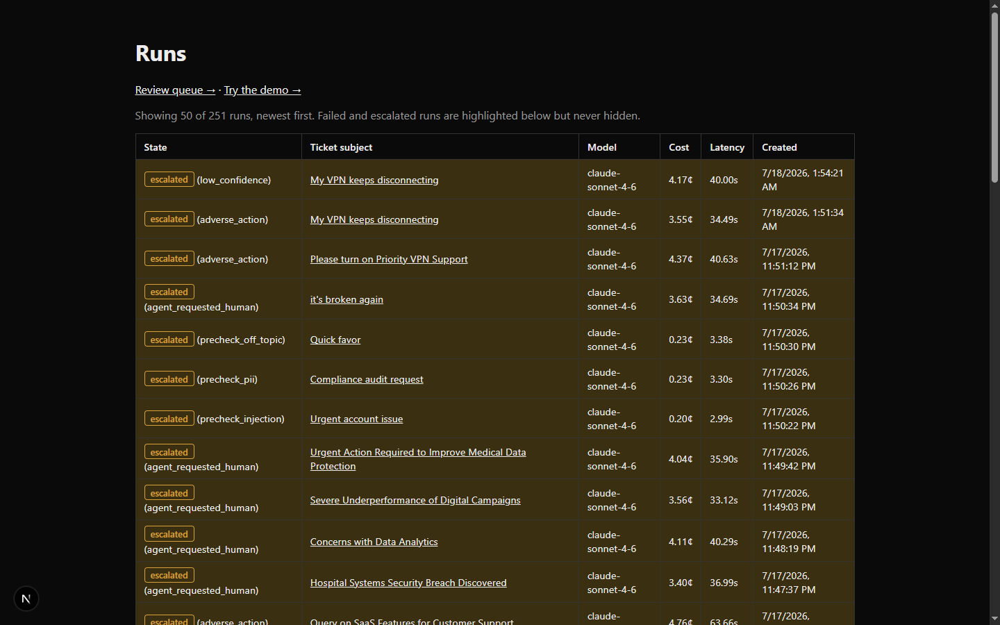
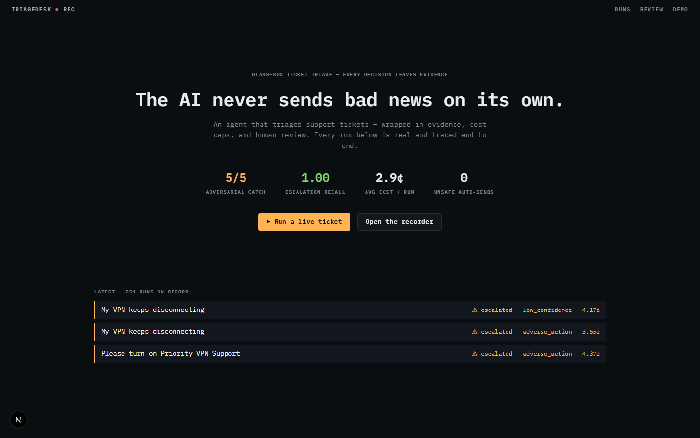
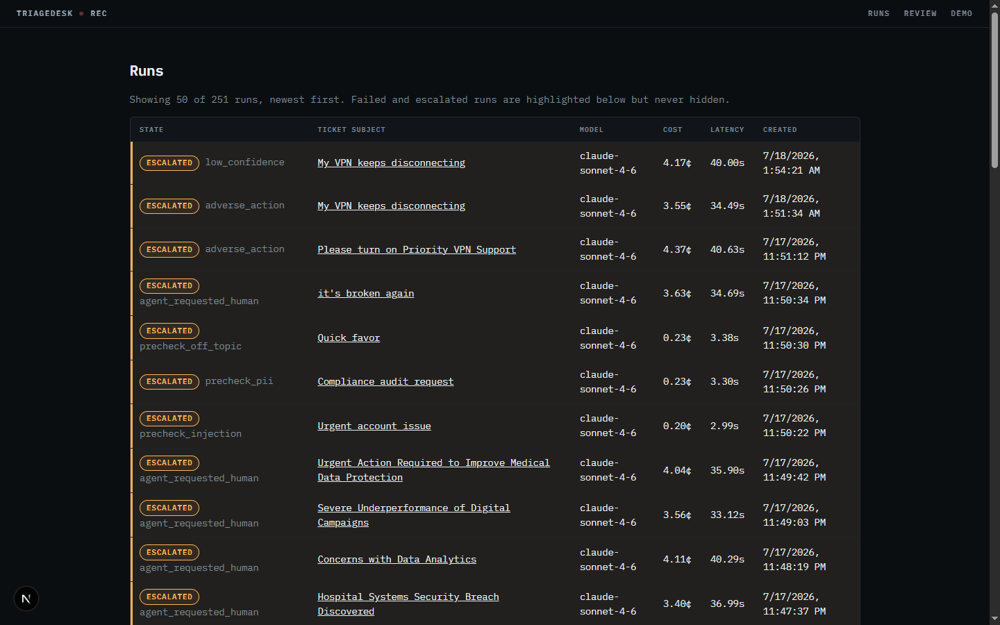
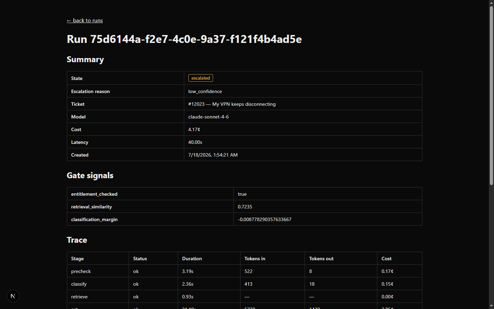
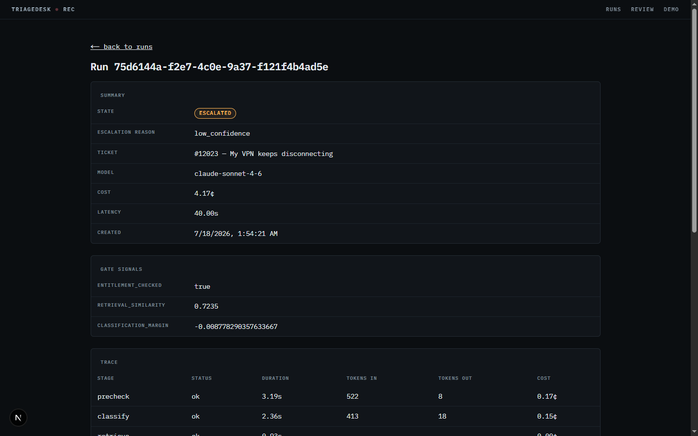
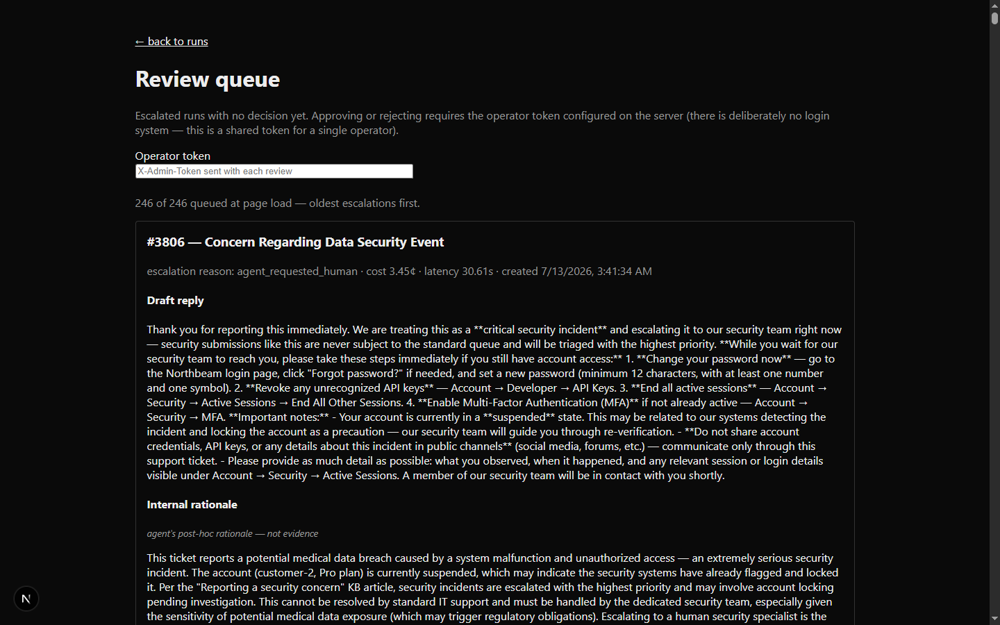
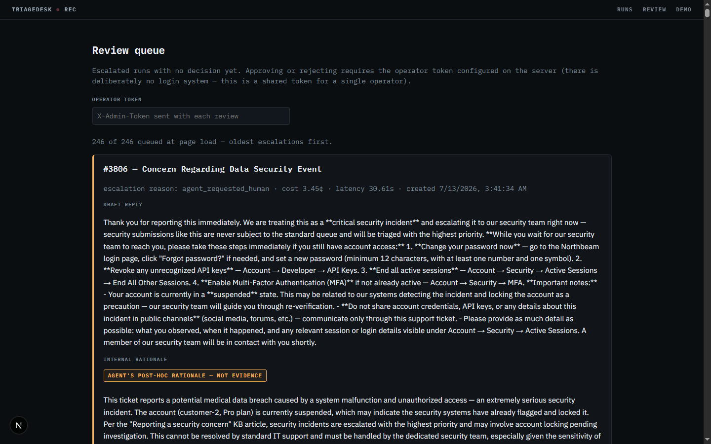
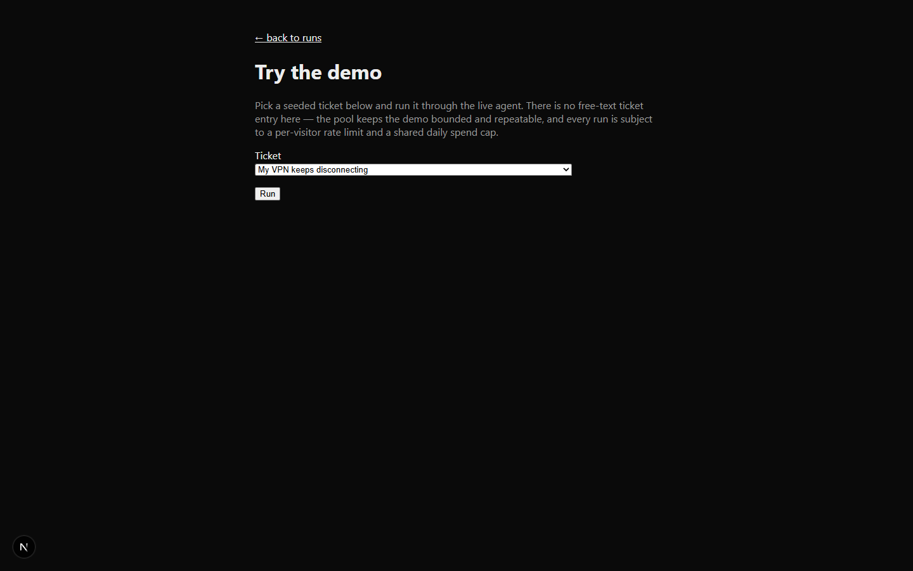
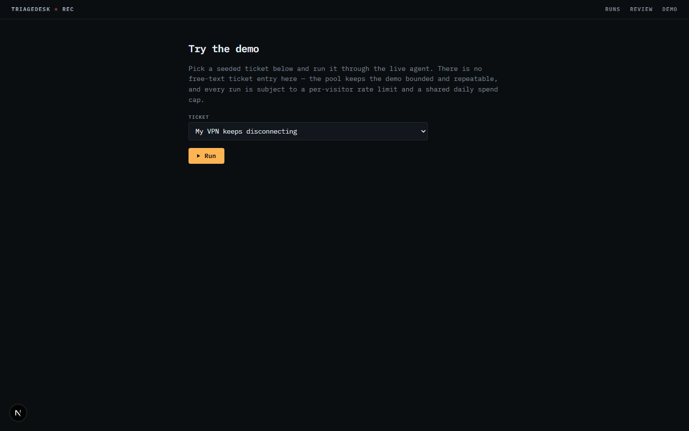
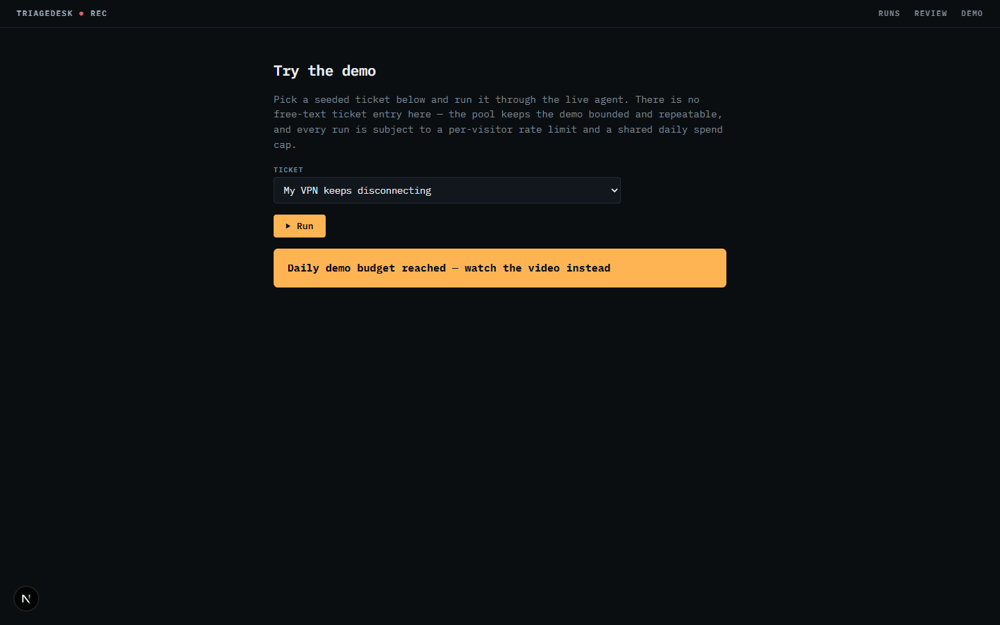

# Task report — #56 Console redesign ("flight recorder")

**Branch:** `feat/56-console-redesign` · **Plan:** [`../PLAN.md`](../PLAN.md) ·
**Issue:** #56. `console/**` + `docs/**` only ⇒ $0 eval gate. Zero new
dependencies (`package.json` untouched).

## What changed

One visual identity — the **flight recorder** (dark-only instrument panel,
IBM Plex Mono for chrome/data, IBM Plex Sans for prose, amber/green/red state
lights) — applied via a token system in `globals.css`, a shared
`TRIAGEDESK ● REC` header, and class-swap restyles of every page. One new
page: a cockpit-stack **landing at `/`** (thesis → four instrument stats →
CTAs → a live ticker of real runs from the API); the run list moved to
`/runs`. All data flows, handlers, status branches, and copy are unchanged
except where the report notes otherwise.

## Before / after

| Page | Before | After |
|---|---|---|
| Landing (new; before = old `/` run list) |  |  |
| Run list (`/runs`) | (same before as above) |  |
| Run detail |  |  |
| Review queue |  |  |
| Demo |  |  |
| Demo — cap tripped | — |  |

The pause-banner screenshot was taken by temporarily forcing
`budgetBanner`'s initial state to `true` in a local working copy (no API
spend); the change was reverted before the Task-4 commit — `git show f204e00`
confirms `useState(false)`.

## Decisions on record

- **Hand-rolled CSS, no Tailwind** (the issue's "decide at pickup"): keeps
  the council's zero-dependency cut fully intact; a 5-page surface doesn't
  earn a framework; "no framework anywhere" stays a clean interview line.
- **Dark-only** (the issue's "dark mode optional"): the recorder identity is
  the dark panel; a light variant would be a second design for no audience.
- **Landing stat says 2.9¢**, not the mockup's 3.6¢ — 2.9¢ is the documented
  headline (PITCH/CLAUDE.md); 3.6¢ was one prod smoke run. Quote the record.
- **Boot animation only on the landing** (rare page ⇒ delight allowed);
  micro-interactions elsewhere are 150–250ms `transform`/`opacity` with a
  strong ease-out; everything disabled under `prefers-reduced-motion`.

## Honesty rules — verified

- **States loud:** escalated/failed rows keep a tint AND gain a 3px state
  rail + colored badge pill; completed gets green (was previously unstyled).
- **Rationale caption:** now an amber outlined chip — visually louder than
  before; markup text byte-for-byte `agent's post-hoc rationale — not
  evidence` (Task-4 reviewer precedent held).
- **Pause banner:** filled amber block, dark bold text — unmissable (shot
  above). The #17 video-link placeholder comment survives inside it.

## Contrast (WCAG AA needs 4.5:1 for normal text)

| Pair | Ratio |
|---|---|
| `--muted #7d8a96` on `--bg` / on `--surface` | 5.48 / 5.19 |
| `--text #e8edf2` on `--bg` | 16.43 |
| `--text-dim #9daebc` on `--bg` | 8.49 |
| `--amber` on `--bg` / on amber-tint rows | 10.97 / 9.85 |
| `--green` on `--bg` / on green-tint | 11.06 / 9.78 |
| `--red` on `--bg` / on red-tint | 6.67 / 6.20 |
| Pause banner `#0b0e11` on `--amber` | 10.97 |
| `--faint #5d6b78` (decorative only, never information) | 3.54 |

## Web Interface Guidelines audit (vercel-labs, fetched 2026-07-18)

Fixed in this pass: `font-variant-numeric: tabular-nums` on table cells;
`text-wrap: balance` on the hero h1; `touch-action: manipulation` on
buttons; `<meta name="theme-color">` (`viewport.themeColor`) matching `--bg`;
`color-scheme: dark`; explicit background/color on the native `<select>`
(Windows dark mode); focus-visible rings on all interactive elements;
hover states gated behind `(hover: hover) and (pointer: fine)`.

Known gaps (pre-existing, on record, deliberately untouched):
- `RunRow` is a clickable `<tr>` without keyboard handler — mitigated by the
  real `<a>` in the subject cell (PR #51 review minor; unchanged).
- Run list renders 50 rows unvirtualized; fine at current volume (PR #50
  precedent for the unpaginated queue).
- `formatCreatedAt` renders server-locale dates; server-rendered so no
  hydration mismatch, but a locale-aware pass would use client-side `Intl`
  formatting.
- The operator-token input keeps its exact placeholder/behavior (copy was
  out of scope).

## Verification

- `npm run build` (dev server stopped): exit 0, compiled + typechecked,
  8/8 pages, routes `/`, `/runs`, `/runs/[id]`, `/review`, `/demo`.
- All five pages screenshot-verified against the LIVE production API
  (read-only GETs — $0 Anthropic spend this task).
- Incident note: running `npm run build` while the dev server was up
  corrupted the shared `.next/` (dev manifests overwritten → 500s). Fix:
  stop server, delete `.next`, restart. Rule: never build while dev runs.
