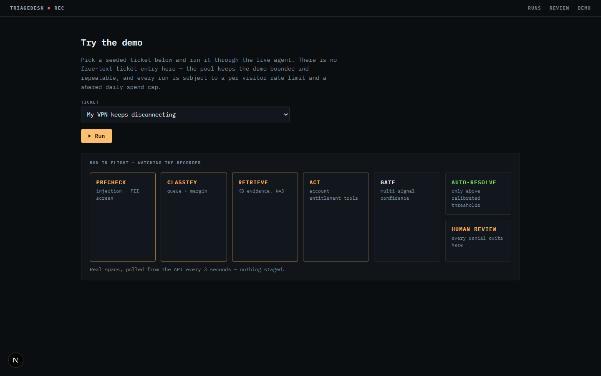
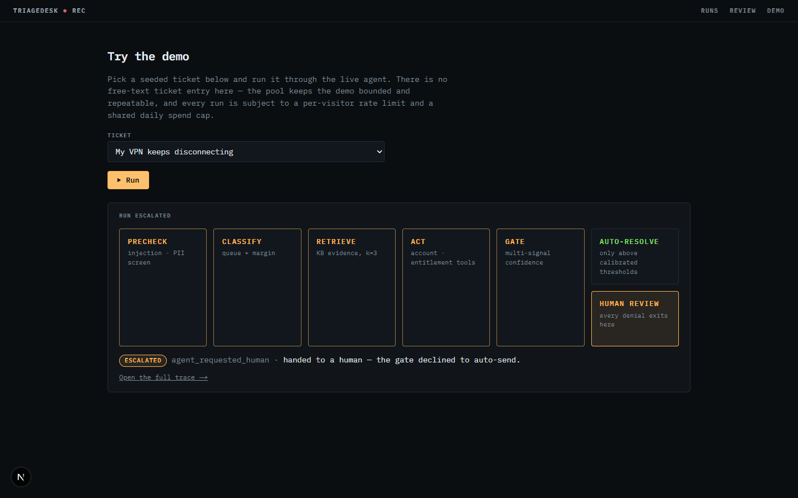

# Task report — #58 Live run progress (+ dashboard landing)

**Branch:** `feat/58-live-run-progress` · **Issue:** #58 · Builds on the merged
#56 redesign (PR #57). ⚠ This task touches `triagedesk/**` (one endpoint) ⇒
the ~$0.90 CI eval gate fires on merge — the first eval-path merge since Week 2,
accepted deliberately at pickup.

## What was built

1. **Dashboard landing** (carried from the #56 follow-up work): animated
   lifecycle pipeline panel, state-distribution bar (status colors + glyph
   legend — never color-alone; palette CVD-validated by the dataviz skill's
   script: worst adjacent pair ΔE 10.8 deutan, all ≥3:1 on surface), live
   ticker panel, stat tiles, hero scanlines + blinking cursor.
2. **Live run progress (#58, the council's pick):** the demo page now watches
   a run execute — `LiveProgress.tsx` polls `GET /api/runs/{id}` every 3s
   ($0 reads), lights the shared pipeline stages as their spans appear
   (spans commit *before* each stage runs — `tracing.py`), and ends loud on
   the real outcome with the escalation reason and a full-trace link.
   Failed runs render loud red ("nothing is hidden").
3. **One shared `Pipeline` component** for landing (ambient) and demo (live)
   — the two can't drift.
4. **Backend fix that makes it possible:** `POST /api/demo/run` previously
   ran the whole pipeline synchronously and returned 202 only at the end —
   a 202 in name only, and unpollable. Now: guards + run-row creation stay
   inside the dispatch lock, the row's id returns immediately, and execution
   moves to a FastAPI `BackgroundTasks` task with its own session
   (`_execute_demo_run`).
5. **Cap-TOCTOU regression closed at the new seam:** with background
   dispatch, a running run's cost isn't committed yet, so
   `daily_cap_would_be_exceeded` now reserves the full per-run cap for every
   `state='running'` run in today's window (fail-closed; double-count error
   bounded at per-run cap, in the safe direction). The PR #55 concurrency
   regression test was re-pointed at the new seam and still fails without
   the lock.
6. **Research-driven motion (2026-current, all zero-dep):** scroll-driven
   reveals for below-fold landing panels (`animation-timeline: view()`,
   `@supports`-gated, no-motion-first), `@starting-style` entrance for the
   live panel. Rejected on the record: View Transitions API (experimental
   Next flag = risk before filming), count-up numbers (stats are strings),
   spring libraries (deps).

## Evidence (all real — local console against local API, live Anthropic)

| Moment | Shot |
|---|---|
| Mid-run: 3 stages done, ACT pulsing |  |
| Terminal: ESCALATED, HUMAN REVIEW lit |  |

Verification run: Dana's VPN ticket through the full pipeline on the dev
Neon branch, escalated `agent_requested_human`, ~3–4¢ (ledger updated).

## Verification

- `pytest tests/unit`: **208 passed** (6 new/updated: cap in-flight reserve,
  202-before-execution, background executor session, re-seamed guard tests).
- `npm run build`: exit 0 (dev server stopped first — the `.next` corruption
  rule from the #56 report held).
- End-to-end: browser click → 202 in <1s → stages lit progressively over
  ~35s → terminal verdict + trace link (screenshots above).
- CORS note: local verification required `CORS_ORIGINS=http://localhost:3000`
  on the local API — client-side fetches are origin-checked where the
  server-rendered pages never were. Documented here because the first
  verification attempt failed exactly this way against prod.

## Decisions on record

- **Fix the API rather than work around it** (Cai's call at the fork): the
  sync endpoint contradicted its own 202; polling the runs list to *find*
  the new run was rejected as a hack that would read as one.
- Live-mode stage states come from **span presence, not timers** — the UI
  can never show progress the DB doesn't have. The "nothing staged" footer
  line is load-bearing copy, not decoration.
- Polling stops on terminal state or ~3min, with an honest "still running"
  handoff to the run page — no spinner-forever state exists.
